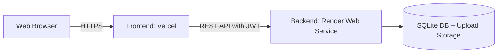

# 🔬 ResearchX – Web Research Analyzer

> **Transform complex, lengthy academic research papers into structured, easy-to-understand visual intelligence reports.**

ResearchX is an AI/NLP-powered full-stack web application designed for students, researchers, and engineers. It ingests research papers (PDFs / OCR scanned documents), segments academic structures, synthesizes 14 core research sections, generates a beginner-friendly 6-question "Easy Summary", and extracts empirical baseline metrics into dynamic interactive charts and tables.

---

## 🏗️ Architecture & Technology Stack

| Layer | Technologies Used |
| :--- | :--- |
| **Backend API** | Python 3.11.8, FastAPI, Uvicorn, Pydantic v2, PyPDF, Pillow, ReportLab |
| **Frontend UI** | React.js 19, Vite, Recharts, Lucide Icons, Axios, Canvas Confetti |
| **Database** | SQLite with SQLAlchemy 2.0 ORM (Auto-migrating schema lifecycle) |
| **Security & Auth** | JWT Bearer Tokens, Bcrypt Password Hashing, Role-Based Access Control (RBAC) |
| **Deployment** | **Render** (FastAPI Backend) & **Vercel** (React Frontend) |

---

## 🚀 Local Development Setup

### Option 1: One-Click Quick Launch (Windows)
Double-click or execute the launcher from the project root:
```cmd
.\start_project.bat
```
* **Frontend**: `http://127.0.0.1:5173`
* **Backend API**: `http://127.0.0.1:8000`
* **Interactive API Docs (Swagger)**: `http://127.0.0.1:8000/docs`

---

### Option 2: Manual Step-by-Step Setup

#### 1. Backend Setup
```bash
cd backend
python -m venv .venv
# On Windows:
.\.venv\Scripts\activate
# On macOS/Linux:
source .venv/bin/activate

pip install -r requirements.txt
python run.py
```
Backend runs at `http://127.0.0.1:8000`.

#### 2. Frontend Setup
```bash
cd frontend
npm install
npm run dev
```
Frontend runs at `http://127.0.0.1:5173`.

---

## 🔐 Default Initial Credentials

| Account Role | Email Address | Password | Privileges |
| :--- | :--- | :--- | :--- |
| **Administrator** | `admin@researchx.com` | `Admin@2026` | Full platform control, User management, Moderation, System metrics |
| **Researcher** | *Self-registration on web UI* | *User password* | Upload papers, NLP analysis, Reports, History export |

---

## 🌐 Production Deployment Guide



---

### Step 1: Push Code to GitHub

1. Initialize Git and stage your files:
```bash
git add .
git commit -m "Configure ResearchX for Render and Vercel production deployment"
git branch -M main
git remote add origin https://github.com/YOUR_GITHUB_USERNAME/ResearchX.git
git push -u origin main
```

---

### Step 2: Deploy Backend to Render

1. Go to [dashboard.render.com](https://dashboard.render.com/) and click **New +** → **Web Service**.
2. Connect your GitHub repository (`ResearchX`).
3. Configure the service settings:
   * **Name**: `researchx-backend`
   * **Language**: `Python 3`
   * **Root Directory**: `backend`
   * **Region**: Choose closest to your users (e.g., `Singapore`, `Frankfurt`, `Oregon`)
   * **Branch**: `main`
   * **Build Command**: `pip install -r requirements.txt`
   * **Start Command**: `uvicorn app.main:app --host 0.0.0.0 --port $PORT`
4. In the **Environment Variables** tab, add:

| Key | Example Value | Description |
| :--- | :--- | :--- |
| `PYTHON_VERSION` | `3.11.8` | Enforces Python runtime version |
| `SECRET_KEY` | *(Generate random 32+ char key)* | Secret key for JWT signing |
| `DATABASE_URL` | `sqlite:///researchx.db` | SQLite database URI |
| `FRONTEND_URL` | `https://your-frontend.vercel.app` | Production frontend domain |
| `CORS_ORIGINS` | `https://your-frontend.vercel.app` | Allowed CORS origins |
| `ADMIN_EMAIL` | `admin@researchx.com` | Administrator bootstrap email |
| `ADMIN_PASSWORD` | `Admin@2026` | Administrator bootstrap password |
| `OPENAI_API_KEY` | *(Optional)* | For external OpenAI analysis |
| `GEMINI_API_KEY` | *(Optional)* | For external Gemini analysis |
| `SMTP_EMAIL` | *(Optional)* | Gmail account for welcome emails |
| `SMTP_PASSWORD` | *(Optional)* | Gmail 16-character App Password |

5. Click **Create Web Service**.
6. Once deployed, copy your Render URL (e.g., `https://researchx-backend.onrender.com`).

---

### Step 3: Deploy Frontend to Vercel

1. Go to [vercel.com](https://vercel.com/) and click **Add New...** → **Project**.
2. Import your GitHub repository (`ResearchX`).
3. Configure Project Settings:
   * **Framework Preset**: `Vite`
   * **Root Directory**: Click *Edit* and select `frontend`
   * **Build Command**: `npm run build` (auto-detected)
   * **Output Directory**: `dist` (auto-detected)
   * **Install Command**: `npm install` (auto-detected)
4. In **Environment Variables**, add:

| Key | Value |
| :--- | :--- |
| `VITE_API_URL` | `https://researchx-backend.onrender.com` *(Your Render backend URL)* |

5. Click **Deploy**.
6. Vercel will build and deploy your React frontend. Copy your Vercel URL (e.g., `https://researchx.vercel.app`).

---

### Step 4: Finalize Backend CORS Connection

1. Return to your **Render Web Service Dashboard**.
2. Update the environment variables:
   * `FRONTEND_URL`: `https://researchx.vercel.app`
   * `CORS_ORIGINS`: `https://researchx.vercel.app`
3. Click **Save Changes**. Render will automatically redeploy with the updated CORS configuration.

---

## 📖 API Documentation

Once the backend is deployed:
* **Interactive Swagger UI**: `https://<YOUR-RENDER-BACKEND>.onrender.com/docs`
* **ReDoc Documentation**: `https://<YOUR-RENDER-BACKEND>.onrender.com/redoc`
* **Health Check**: `https://<YOUR-RENDER-BACKEND>.onrender.com/api/health`

---

## 📁 Repository Structure

```
FULLSTACK/
├── .gitignore                   # Root Git ignore (venv, env, dist, db)
├── .python-version              # Python 3.11.8 specification
├── start_project.bat            # One-click Windows full-stack launcher
├── README.md                    # Project documentation & deployment guide
├── backend/
│   ├── .env.example             # Backend environment template
│   ├── .python-version          # Python 3.11.8 specification
│   ├── requirements.txt         # Production backend dependencies
│   ├── run.py                   # Local development server runner
│   ├── app/
│   │   ├── main.py              # FastAPI gateway & CORS configuration
│   │   ├── core/                # Config, JWT security, auth handlers
│   │   ├── database/            # SQLite engine & session dependency
│   │   ├── models/              # SQLAlchemy models (User, Paper, Analysis, etc.)
│   │   ├── routers/             # API routes (Auth, Papers, Analysis, Admin, etc.)
│   │   ├── schemas/             # Pydantic v2 schemas & validation
│   │   └── services/            # NLP, OCR, PDF parsing, visualizations
│   └── demo_papers/             # Built-in sample papers (ResNet, Attention, etc.)
└── frontend/
    ├── .env.example             # Frontend environment template
    ├── vercel.json              # Vercel SPA client-side routing config
    ├── package.json             # React 19 & Vite dependencies
    ├── vite.config.js           # Vite dev proxy configuration
    └── src/
        ├── App.jsx              # Client router & toast providers
        ├── components/          # Navigation, charts, modals, notifications
        ├── pages/               # Dashboard, Upload, Analysis, Admin, Auth
        ├── services/            # Axios API clients
        └── styles/              # Design system & dark theme stylesheets
```

---

## 🔒 Security & Data Integrity Highlights

* **Role-Based Access Control**: Strict separation between `ADMIN` and `USER` roles enforced at the database and API gateway layers.
* **Bcrypt Password Security**: Passwords are securely hashed with bcrypt; plaintext passwords are never stored or transmitted.
* **Data Integrity**: Visualization charts are exclusively generated from empirical metrics extracted from the source document (zero-hallucination guarantee).
* **Single-Use Password Recovery**: Secure, time-limited tokens with replay protection for password resets.
